  

  

  

  &nbsp;
  &nbsp;
  
  
  
     

  Hi, I'm Shijin Zhang — you can call me Doven. 
  I'm passionate about open-source LLM inference, high-performance computing, and efficient AI systems. 
  Feel free to reach me at <a href="mailto:dovis.zhang02@gmail.com">dovis.zhang02@gmail.com</a>. Thanks for visiting!

## 🛠 Tech Stack

| Property | Data |
| :--- | :--- |
| **Language / IDE** | &nbsp; &nbsp; &nbsp; &nbsp; &nbsp; &nbsp; &nbsp; &nbsp; |
| **Domain Knowledge** | &nbsp; &nbsp; &nbsp; &nbsp; |
| **LLM Inference / Acceleration** | &nbsp; &nbsp; &nbsp; &nbsp; &nbsp; &nbsp; &nbsp; &nbsp; &nbsp; |
| **Web Development** | &nbsp; &nbsp; |
| **CI / CD & Tools** | &nbsp; &nbsp; &nbsp; &nbsp; &nbsp; |
| **Databases** | &nbsp; &nbsp; &nbsp; &nbsp; |
| **ML / Deep Learning Frameworks** | &nbsp; &nbsp; &nbsp; &nbsp; &nbsp; &nbsp; |

## 📈 GitHub Contribution Activity

<picture>
  <source media="(prefers-color-scheme: dark)" srcset="https://raw.githubusercontent.com/Dovis01/Dovis01/output/github-contribution-grid-snake-dark.svg" />
  <source media="(prefers-color-scheme: light)" srcset="https://raw.githubusercontent.com/Dovis01/Dovis01/output/github-contribution-grid-snake.svg" />
  
</picture>
